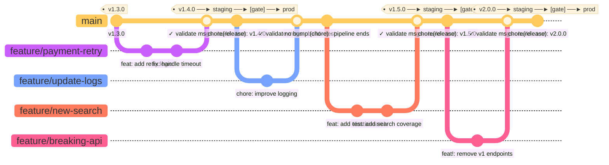
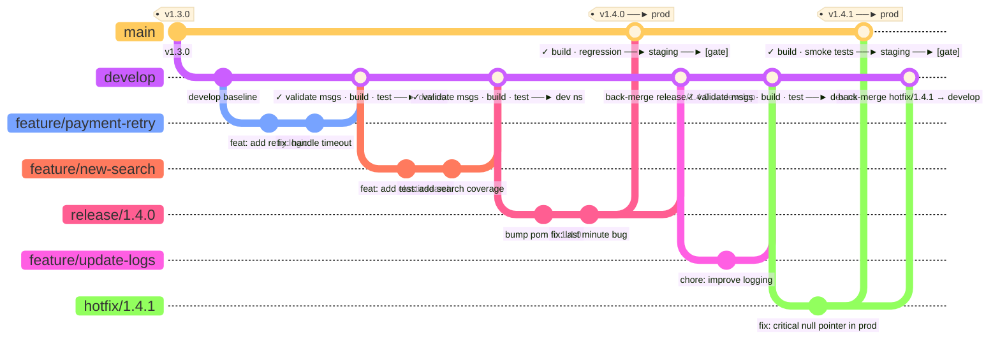
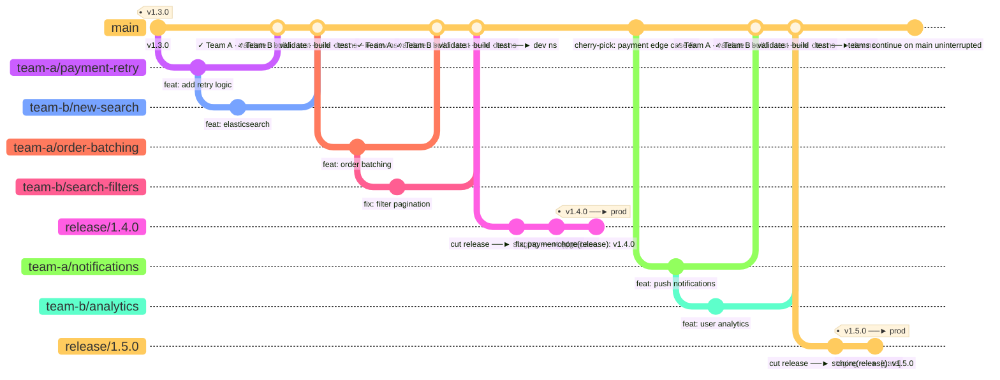

# Trunk-Based Development · CI Pipeline Flow




   


## Branch roles & CI behaviour

| Branch | Created from | Merges into | CI triggers | Deploys to |
|--------|-------------|-------------|-------------|------------|
| `feature/*` | `develop` | `develop` | validate msgs · build · test | nothing (PR only) |
| `develop` | — | — | build · test | dev namespace |
| `release/*` | `develop` | `main` + `develop` | build · regression tests | staging namespace |
| `main` | — | — | tag → mvn deploy → Nexus | staging → [gate] → prod |
| `hotfix/*` | `main` | `main` + `develop` | build · smoke tests | staging → [gate] → prod |

## Key principles

- Feature branches never touch `main` — all integration goes through `develop` first
- `develop` is always deployable to the dev environment on every merge
- Release branches are for stabilisation only — no new features, only bug fixes
- Tags are created exclusively on `main` (by semantic-release or mvn release plugin)
- Back-merges from `release/*` and `hotfix/*` into `develop` are mandatory — skip them and develop drifts from prod
- Hotfixes bypass the normal release cycle and go straight to `main` for critical prod issues
- `[skip ci]` on version bump commits prevents pipeline loops


## Branch roles & CI behaviour

| Branch | Created from | Merges into | CI triggers | Deploys to |
|--------|-------------|-------------|-------------|------------|
| `feature/*` | `develop` | `develop` | validate msgs · build · test | nothing (PR only) |
| `develop` | — | — | build · test | dev namespace |
| `release/*` | `develop` | `main` + `develop` | build · regression tests | staging namespace |
| `main` | — | — | tag → mvn deploy → Nexus | staging → [gate] → prod |
| `hotfix/*` | `main` | `main` + `develop` | build · smoke tests | staging → [gate] → prod |

## Key principles

- Feature branches never touch `main` — all integration goes through `develop` first
- `develop` is always deployable to the dev environment on every merge
- Release branches are for stabilisation only — no new features, only bug fixes
- Tags are created exclusively on `main` (by semantic-release or mvn release plugin)
- Back-merges from `release/*` and `hotfix/*` into `develop` are mandatory — skip them and develop drifts from prod
- Hotfixes bypass the normal release cycle and go straight to `main` for critical prod issues
- `[skip ci]` on version bump commits prevents pipeline loops
```

## Rules at a glance

| Commit type | Version bump | Tag created | Deploys to |
|-------------|-------------|-------------|------------|
| `feat:` | minor (1.4.0 → 1.5.0) | yes | staging → [gate] → prod |
| `fix:` | patch (1.4.0 → 1.4.1) | yes | staging → [gate] → prod |
| `feat!:` / `BREAKING CHANGE:` | major (1.x.x → 2.0.0) | yes | staging → [gate] → prod |
| `chore:` `docs:` `test:` `refactor:` | none | no | pipeline ends after main build |

## Key principles

- Feature branches are short-lived (hours to 2 days max)
- Every merge to `main` triggers a full build and test run
- Only `feat`, `fix`, and breaking changes produce a tag
- Production deploys are tag-driven, not branch-driven
- Manual approval gate sits between staging and prod
- `[skip ci]` on the semantic-release version bump commit prevents pipeline loops


# GitFlow · CI Pipeline Flow


## Branch roles & CI behaviour

| Branch | Created from | Merges into | CI triggers | Deploys to |
|--------|-------------|-------------|-------------|------------|
| `feature/*` | `develop` | `develop` | validate msgs · build · test | nothing (PR only) |
| `develop` | — | — | build · test | dev namespace |
| `release/*` | `develop` | `main` + `develop` | build · regression tests | staging namespace |
| `main` | — | — | tag → mvn deploy → Nexus | staging → [gate] → prod |
| `hotfix/*` | `main` | `main` + `develop` | build · smoke tests | staging → [gate] → prod |

## Key principles

- Feature branches never touch `main` — all integration goes through `develop` first
- `develop` is always deployable to the dev environment on every merge
- Release branches are for stabilisation only — no new features, only bug fixes
- Tags are created exclusively on `main` (by semantic-release or mvn release plugin)
- Back-merges from `release/*` and `hotfix/*` into `develop` are mandatory — skip them and develop drifts from prod
- Hotfixes bypass the normal release cycle and go straight to `main` for critical prod issues
- `[skip ci]` on version bump commits prevents pipeline loops


# Scaled Trunk-Based Development · CI Pipeline Flow



## How scaled TBD differs from regular TBD

| | Regular TBD | Scaled TBD |
|---|---|---|
| Teams | Single team | Multiple teams |
| Release from | `main` directly | `release/*` branch cut from `main` |
| Tag lives on | `main` | `release/*` branch |
| Teams during release stabilisation | Wait or use flags | Keep merging to `main` uninterrupted |
| Fixes on release branch | N/A | Cherry-picked back to `main` |
| Release cadence | Continuous (every qualifying merge) | Scheduled (cut branch when ready) |

## Branch roles & CI behaviour

| Branch | Created from | CI triggers | Deploys to |
|--------|-------------|-------------|------------|
| `team-*/feature` | `main` | validate msgs · build · test | nothing (PR only) |
| `main` | — | build · integration tests | dev namespace on every merge |
| `release/*` | `main` (at planned cut point) | regression · smoke tests | staging → [gate] → prod |

## Key principles

- All teams integrate to `main` — never to each other's branches
- Feature branches are still short-lived (1–2 days max per team)
- The release branch is cut when `main` is stable enough, not on a fixed date
- Once the release branch is cut, teams keep merging to `main` — next release cycle starts immediately
- Stabilisation fixes go onto the release branch first, then are **cherry-picked back to `main`** — never the other way around
- The release branch is one-way: it is never merged back into `main` (unlike GitFlow's back-merge)
- Tags live on the release branch, not on `main`
- `main` is always the integration point and is always green — if it breaks, fixing it is the entire team's top priority


What changes between the two strategies
Pipeline stageGitFlowScaled TBDDev namespace deploydevelop branchmain branchStaging namespace deployrelease/* branchrelease/* branchTag created onmain (after release merges in)release/* branch directlymain triggersnothing (just build+test)build + test + dev deployrelease/* triggersstaging deploy onlystaging deploy + tag


# GitFlow vs Scaled TBD · Pipeline Behaviour Comparison
 
## What changes between the two strategies
 
| Pipeline stage | GitFlow | Scaled TBD |
|---|---|---|
| CAB namespace deploy | `feature` branch | `feature` branch |
| Dev namespace deploy | `develop` branch | `main` branch |
| CD Testing namespace deploy | `develop` branch | `main` branch |
| SIT1/SIT2 deploy | `release/*` branch | `release/*` branch |
| Tag created on | `main` (after release merges in) | `release/*` branch directly |
| `main` triggers | nothing (just build + test) | build + test + dev deploy |
| `release/*` triggers | staging deploy only | staging deploy + tag |
