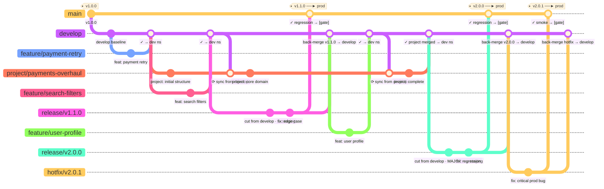
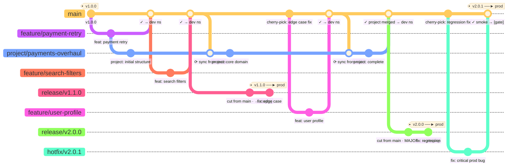

# Release Train Branching Strategies
## GitFlow-based vs Scaled TBD · Side-by-side Comparison

---

## Strategy 1 · GitFlow-based Release Train



### Key observations
- `develop` acts as a crash buffer — broken commits never touch `main`
- Release branch is cut **from `develop`**, not `main`
- Back-merges go to **both** `main` and `develop` after every release and hotfix
- Project branch syncs **from `develop`** — may occasionally sync unstable code
- Tag lives on `main` after the release branch merges in
- Teams working on features are unaffected by release stabilisation (on `develop`)

---

## Strategy 2 · Scaled TBD Release Train



### Key observations
- No `develop` — `main` is the only integration point and must always be green
- Release branch cut **from `main`** directly
- Stabilisation fixes go onto `release/*` first, then **cherry-picked back to `main`** — never a full back-merge
- Tag lives **on the release branch**, not on `main`
- Project branch syncs **from `main`** — always syncing against production-quality code
- Teams keep merging to `main` while the release branch stabilises (visible after v1.1.0 cut)
- Hotfix merges directly to `main` and gets tagged there

---

## Head-to-head comparison

| | GitFlow-based Release Train | Scaled TBD Release Train |
|---|---|---|
| Branch count | 6 types | 5 types (no `develop`) |
| Integration point | `develop` | `main` |
| Dev namespace deploys from | `develop` | `main` |
| Release branch cut from | `develop` | `main` |
| Tag lives on | `main` | `release/*` branch |
| Stabilisation fix direction | `release/*` → back-merge to `main` + `develop` | `release/*` → cherry-pick to `main` |
| Project branch syncs from | `develop` (may be unstable) | `main` (always production-quality) |
| Broken commit consequence | `develop` breaks — `main` safe | `main` breaks — whole team stops |
| Hotfix back-merge | `main` + `develop` | `main` only |
| Discipline required | Medium | High |
| Best for | Teams building CI discipline | Teams with strong test coverage and fast pipelines |

---

## Feature freeze rule (both strategies)

PRs from `project/*` to `develop` (GitFlow) or `main` (Scaled TBD) must be merged
**at least 2 working days before the release branch is cut** — no exceptions.
Miss the window and the project catches the next train.

```
3-week minor  →  feature freeze on day 16 of 21  →  release branch cut day 18
6-week major  →  feature freeze on day 33 of 42  →  release branch cut day 36
```
