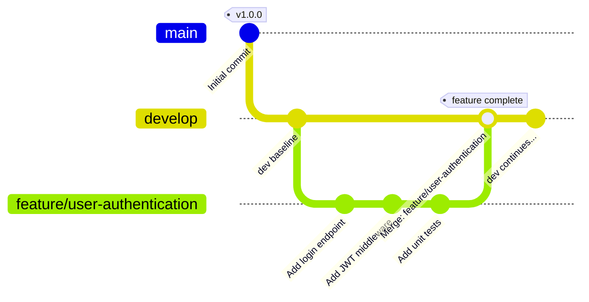
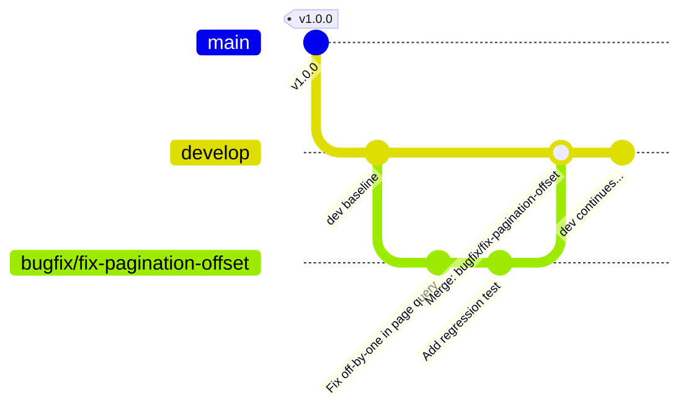
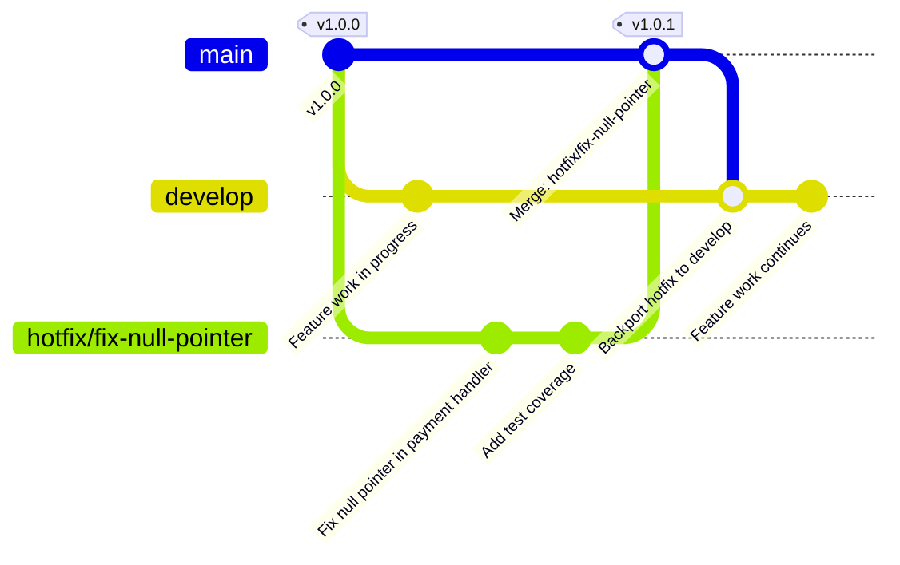
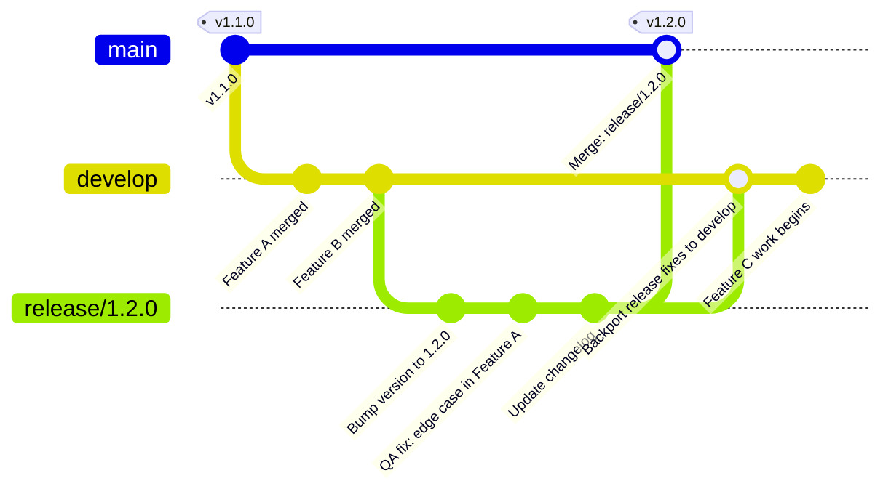

# Moving from Trunk-Based Development to Gitflow
### Why Scheduled Releases Demand a Different Branching Strategy

---

## The Case for Change

Trunk-Based Development (TBD) is a powerful model — when your team ships continuously. Every commit goes to `main`, feature flags gate unfinished work, and you deploy many times a day. But when your team operates on **scheduled releases** — bi-weekly sprints, versioned software, regulated deployments — TBD starts to work against you.

The core problem: TBD gives you **one shared truth**. That's a strength when you deploy instantly, but a liability when you need to:

- Freeze a release candidate while development continues
- Patch a critical bug in production without dragging in half-finished features
- Run parallel tracks of work across multiple upcoming versions
- Give QA a stable branch to test without developers breaking it

**Gitflow** was designed exactly for this. It provides explicit, purpose-built branches for every phase of your software lifecycle — nothing is ambiguous, nothing is mixed.

---

## TBD vs Gitflow: At a Glance

| Concern | Trunk-Based Development | Gitflow |
|---|---|---|
| **Primary branch** | `main` only | `main` + `develop` |
| **Feature isolation** | Feature flags in code | Dedicated `feature/*` branches |
| **Release preparation** | Tag a commit on `main` | Dedicated `release/*` branch |
| **Production hotfixes** | Commit directly to `main` | `hotfix/*` branch off `main`, merged to both `main` and `develop` |
| **Bug fixes** | Commit to `main` | `bugfix/*` branch off `develop` |
| **Release cadence** | Continuous deployment | Scheduled / versioned releases |
| **Parallel versions** | Very difficult | First-class support |
| **Rollback story** | Re-deploy previous tag | Named release branches persist |
| **Team size** | Works well for small, senior teams | Scales well with larger or distributed teams |
| **CI/CD complexity** | Simpler pipelines | Slightly more pipeline configuration |
| **Risk of breaking `main`** | High — all work merges fast | Low — `main` only ever receives merge commits from `release/*` or `hotfix/*` |

**Bottom line:** If your team does not deploy on every commit, TBD is solving the wrong problem. Gitflow gives you the guardrails that scheduled releases require.

---

## The Gitflow Branch Model — Overview

Before the individual scenarios, here is a quick reference for the five branch types you will use:

| Branch | Created from | Merges into | Purpose |
|---|---|---|---|
| `main` | — | — | Production-ready code only |
| `develop` | `main` | — | Integration branch for next release |
| `feature/*` | `develop` | `develop` | New functionality |
| `bugfix/*` | `develop` | `develop` | Non-critical bug fixes for the next release |
| `release/*` | `develop` | `main` + `develop` | Release preparation and stabilisation |
| `hotfix/*` | `main` | `main` + `develop` | Emergency patches to production |

---

## Scenario 1 — Feature Development

### The Problem with TBD

In TBD, a developer working on a large feature commits directly to `main` or a very short-lived branch. This means:

- Incomplete code sits in `main` behind a feature flag
- Feature flags accumulate and become a maintenance burden
- A broken half-finished feature can block the release of unrelated work

### How Gitflow Solves It

Each feature gets its own `feature/*` branch created from `develop`. The feature is developed, reviewed, and only merged back to `develop` when it is **complete and reviewed**. The `develop` branch accumulates finished features, and `main` never sees any of this work until a full release cycle completes.

Multiple features can be developed in parallel without interfering with each other or with the upcoming release.

### Workflow

1. Branch off `develop`: `git checkout -b feature/user-authentication develop`
2. Develop the feature with full commit history
3. Open a pull request targeting `develop`
4. After review and approval, merge into `develop` and delete the feature branch
5. Feature is now queued for the next scheduled release

### Gitgraph — Feature Branch Lifecycle



> **Focus here:** The `feature/*` branch is entirely isolated from `develop` until it is ready. No feature flags, no half-baked code on shared branches.

---

## Scenario 2 — Bug Fix (Next Release)

### The Problem with TBD

In TBD, all bug fixes go directly to `main`. This is fine for continuous deployment, but creates problems when:

- The bug fix needs code review before it reaches users
- You have a scheduled release in two weeks and don't want to break the current QA cycle
- The fix touches code that also has an in-progress feature branch open

### How Gitflow Solves It

Non-critical bug fixes belong on a `bugfix/*` branch created from `develop`. These go through the normal review process and land in `develop` to be shipped as part of the next scheduled release — not immediately into production.

This gives QA a predictable target. The fix is reviewed, tested, and batched with other work in the upcoming release window.

### Workflow

1. Branch off `develop`: `git checkout -b bugfix/fix-pagination-offset develop`
2. Implement the fix
3. Open a pull request targeting `develop`
4. After review, merge into `develop` and delete the bugfix branch
5. Fix ships with the next scheduled release

### Gitgraph — Bugfix Branch Lifecycle



> **Focus here:** The bug fix is isolated, reviewed, and queued for the next release — not pushed directly to `main`. Production remains untouched until the release cycle completes.

---

## Scenario 3 — Hotfix (Emergency Production Patch)

### The Problem with TBD

In TBD, there is only one branch, so a production emergency means committing to `main` and deploying. This is fine if deployment is instant, but creates serious risk when:

- Other developers have already committed work-in-progress to `main`
- You can't easily separate "the fix" from "everything else that landed today"
- Rolling back means reverting multiple unrelated commits

### How Gitflow Solves It

`hotfix/*` branches are created directly from `main` (i.e., from production). This gives you a **clean, isolated surface** to apply the fix without any in-progress development bleeding in. Once the fix is ready, it merges into **both `main` and `develop`** — so the patch reaches production immediately *and* carries forward into the next release.

This is Gitflow's most powerful feature for teams with scheduled releases. You can ship an emergency patch at 2am without touching anything in your current release cycle.

### Workflow

1. Branch off `main`: `git checkout -b hotfix/fix-null-pointer main`
2. Apply the minimal fix
3. Open a pull request targeting `main`
4. After review, merge into `main` and tag the release: `git tag -a v1.0.1`
5. Also merge `main` into `develop` to keep the fix in the upcoming release
6. Delete the hotfix branch

### Gitgraph — Hotfix Branch Lifecycle



> **Focus here:** The `hotfix/*` branch is created from `main` — clean production code, zero development noise. After merging, `develop` is updated so the fix doesn't get accidentally reverted in the next release.

---

## Scenario 4 — Release Preparation

### The Problem with TBD

In TBD, "release preparation" typically means tagging a commit. There is no dedicated space to:

- Stabilise and harden the code before it ships
- Allow QA to test a frozen snapshot while developers keep committing new features
- Make last-minute release-only tweaks (version bumps, config changes, changelog updates) without blocking feature work

### How Gitflow Solves It

When `develop` has accumulated the features intended for the next release, a `release/*` branch is cut from `develop`. **From this point, developers can continue building new features on `develop` for the release after next** — the release candidate is frozen from new feature work.

The `release/*` branch accepts only:
- Bug fixes found during QA
- Version bumps
- Documentation and changelog updates

When the release is signed off, it merges into `main` (tagged as the version) and back into `develop` (so any release-phase fixes are preserved).

### Workflow

1. Cut the branch from develop: `git checkout -b release/1.2.0 develop`
2. Bump the version number, update the changelog
3. QA tests this branch — bug fixes go here, NOT on `develop`
4. When signed off, merge into `main`: tag as `v1.2.0`
5. Merge `release/1.2.0` back into `develop` to carry forward any fixes
6. Delete the release branch

### Gitgraph — Release Branch Lifecycle



> **Focus here:** Once `release/1.2.0` is cut, `develop` is free to accept work for `v1.3.0` immediately. QA has a frozen target. Production receives only signed-off code.

---

## Migrating from TBD to Gitflow

This does not need to be a big-bang switch. Below is a practical path to migrate without disrupting ongoing work.

### Step 1 — Create the `develop` branch

```bash
# From your current main
git checkout main
git checkout -b develop
git push -u origin develop
```

Set `develop` as the default branch in your repository settings (GitHub / GitLab / Bitbucket). All future pull requests should target `develop` by default.

### Step 2 — Update branch protection rules

| Branch | Protection |
|---|---|
| `main` | No direct pushes. Merge only from `release/*` or `hotfix/*`. Require PR + 1 approval. |
| `develop` | No direct pushes. Merge only from `feature/*`, `bugfix/*`, or `release/*` backmerges. Require PR + 1 approval. |

### Step 3 — Adopt branch naming conventions

Enforce consistent naming from day one:

```
feature/<short-description>       e.g. feature/user-authentication
bugfix/<short-description>        e.g. bugfix/fix-pagination-offset
hotfix/<short-description>        e.g. hotfix/fix-null-pointer
release/<semver>                  e.g. release/1.2.0
```

Consider a Git hook or CI check that rejects branches not matching these patterns.

### Step 4 — Update your CI/CD pipeline

- `develop` → trigger CI (build + unit tests)
- `release/*` → trigger CI + integration tests + deploy to staging
- `main` → trigger CI + deploy to production
- `feature/*`, `bugfix/*`, `hotfix/*` → trigger CI on pull request only

### Step 5 — Migrate in-flight work

For any branches currently in progress:
1. Rebase them onto `develop` instead of `main`
2. Update open pull requests to target `develop`
3. Do **not** merge anything new into `main` directly from this point forward

### Step 6 — Cut your first release branch

When `develop` is ready for its next scheduled release, cut `release/x.y.0`. This is the moment the team will feel the full benefit — QA has a stable branch, and feature work continues uninterrupted on `develop`.

---

## Summary

Gitflow is not bureaucracy. It is structure that mirrors the reality of how scheduled-release teams actually work. By giving every type of work — features, bug fixes, hotfixes, and releases — its own dedicated branch type with clear rules, you get:

- **Predictable releases** — `main` only ever receives finished, signed-off work
- **Parallel development** — next release and next-next release can progress simultaneously
- **Safe emergency patches** — hotfixes operate on clean production code, never on development noise
- **Clear code review targets** — every PR has an obvious, unambiguous destination

The investment in learning the branching model pays back on your very first scheduled release.

---

*Document version: 1.0 — April 2026*
